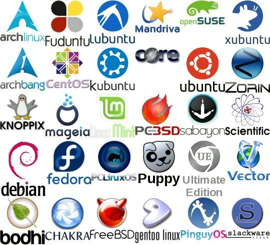
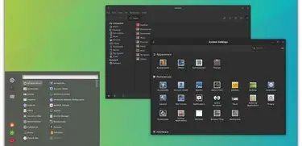

# Extra Credit 1: Markdown

# Document 1: What is Linux

## Introduction

Linux is an operating system, similar to Windows, iOS, and Mac OS. It is used in many different types of technology, including smartphones, cars, supercomputers, home appliances, desktops, and servers. The article also explains that Linux is used on the Internet, at stock exchanges, and on many of the world's most powerful supercomputers.

An operating system manages the resources of a computer and allows software to communicate with the computer's hardware. Linux is made up of several important parts that work together to provide a complete operating system.

Main Parts of Linux
Bootloader – The software that manages the boot process of the computer.
Kernel – The main part of the Linux operating system.
Init system – The system that manages processes after the computer starts.
Daemons – Background services that perform different tasks.
Graphical server – Provides the graphical system that allows applications and desktop environments to work.
Desktop environment – Provides the graphical interface that users interact with.
Applications – Programs that allow users to perform different tasks.

## Why use Linux? 
One reason to use Linux is its reliability. The article also discusses the cost of Linux and explains that there can be no cost to download and install many Linux distributions. This can make Linux different from operating systems and server software that require a license.

Another reason discussed in the article is security. The author explains that Linux is less vulnerable to malware, ransomware, and viruses compared with some other operating systems. The article also connects Linux's security to its open-source development model.

Linux is commonly represented by a penguin mascot called tux.
## Linux Distributions

A Linux distribution, also called a distro, is a version of Linux that combines the operating system with different software and a particular desktop environment.

Many Linux distributions can be downloaded for free. They can also be placed on a disk or USB drive and installed on a computer.

Some examples of Linux distributions mentioned in the article are:

Linux Mint
Manjaro
Debian
Ubuntu
Antergos
Solus
Fedora
Elementary OS
openSUSE: 
- Ubuntu
- Fedora
- Debian
- Linux Mint

## Linux Distribution Comparison

choosing a Linux distribution depends on a few important questions.

Skill Level

A person's experience with Linux can help determine which distribution they should use.

Some distributions recommended for beginners include:

Linux Mint
Ubuntu
Elementary OS
Deepin

For users with more experience, the article mentions distributions such as Debian and Fedora. For highly skilled users, Gentoo is mentioned. The article also describes Linux From Scratch as an option for people looking for a challenge.

| Distribution | Description |
|---           |---          |
| Ubuntu | Beginner-friendly |
| Fedora | Modern Linux distribution |
| Debian | Stable Linux distribution |

## Linux Desktop Environment 
Desktop environments provide the graphical interface...

1. Cinnamon
2. KDE Plasma
3. Xfce
