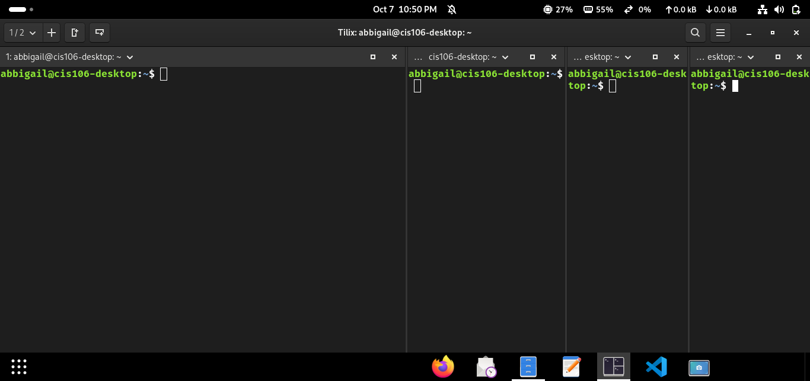
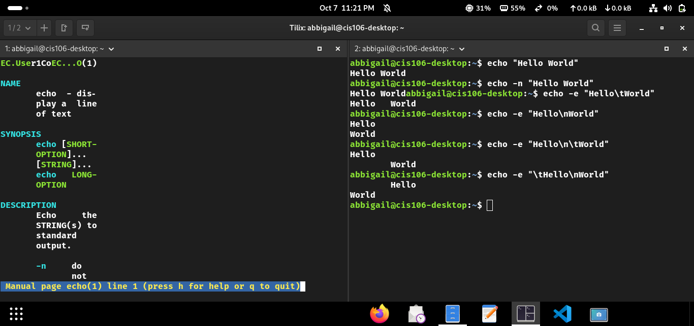
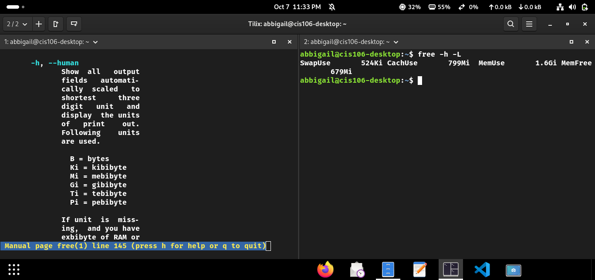
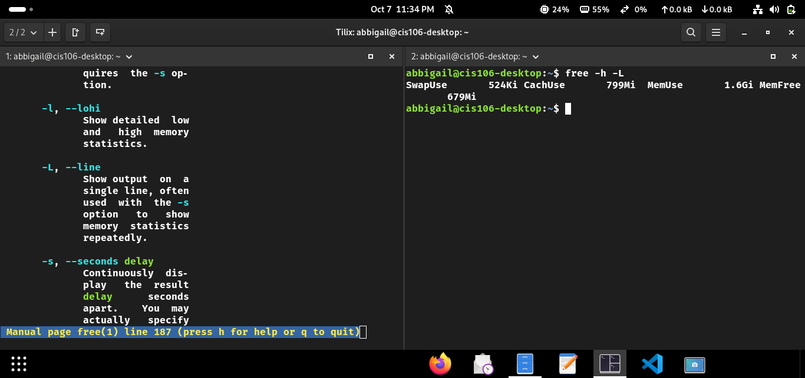
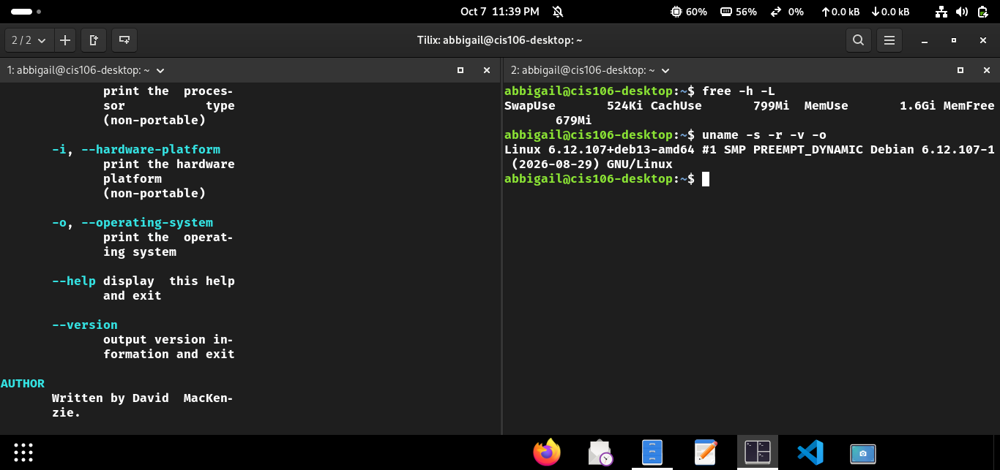
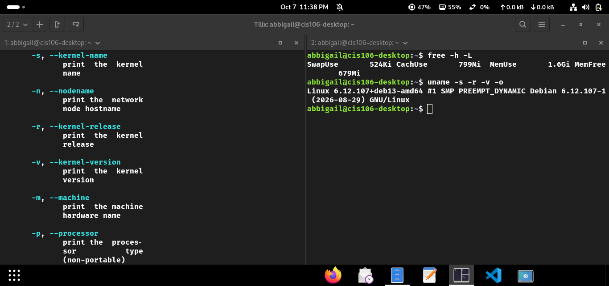
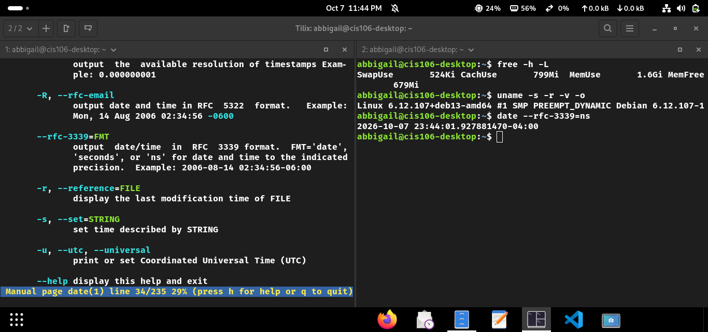

# Lab 3 Submission

## Question 1

## Question 2

## Question 3

## Challenge Question
1. John wants to see how much free memory he has in his system. He understands that the free command is used for this however, he would like the output of the command to appear in a single line and with human readable format.

What is the complete command that John has to use here? free -h -L 

Take a screenshot showing the man page showing the correct options and the command and its output. See the example for a reference.

2. Kenny is a system administrator working on automation scripts. He is building a script where he needs to know the kernel name, kernel release, kernel version, and operating system of the computer. He knows that the uname command can provide this information.

What is the complete command that Kenny has to use here? uname -s -r -v -o

Take a screenshot showing the man page showing the correct options and the command and its output. See the example for a reference.

3. Dave is working with an API that only accepts rfc-3339 time format for dates. For example, 2025-09-10 18:39:53.467197335-04:00 is an acceptable format but anything else will return an error. He needs a date command that will allow him to convert the current time into rfc-3339 format.

What is the complete command that Dave has to use here? date --rfc-3339=ns

Take a screenshot showing the man page showing the correct options and the command and its output. See the example for a reference.

